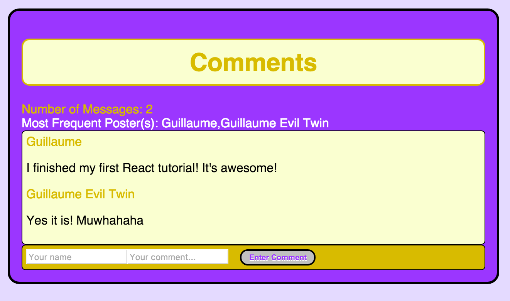

[](https://heroku.com/deploy)

# React Tutorial

This is the React comment box example from [the React tutorial](http://facebook.github.io/react/docs/tutorial.html).

### How to use on Node

```sh
npm install
node server.js
```

You can now visit <http://localhost:3000/> and this is what you should see:



### Added Features:
- A counter for the total number of messages sent.
- A “Most frequent poster” feature that says who has sent the most messages.
- Styling with Sass & CSS
